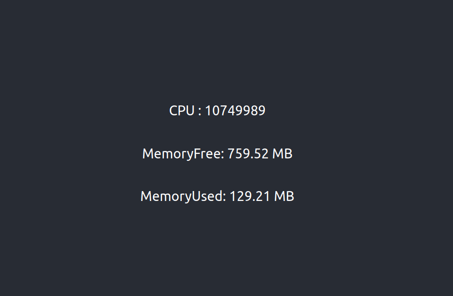

# Hardware Monitor with GO, gRPC and React

Displays real time information about CPU usage and Memory usage using
GO server and sends the info via gRPC and is displayed in the browser via React

## Run Project

Just run `start.sh` and go to [http://localhost:8080/](http://localhost:8080/)

 

  

